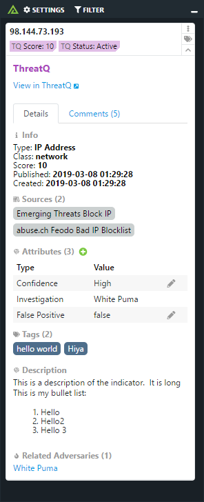
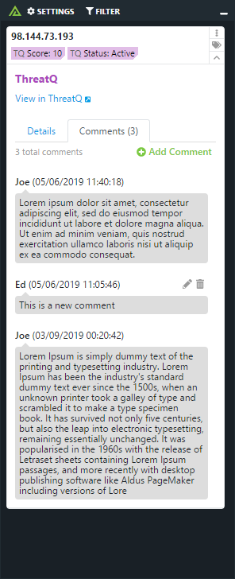

# Polarity ThreatQuotient Integration

Polarity's ThreatQuotient integration gives users access to automated MD5, SHA1, SHA256, IPv4, IPv6, CIDR, and Domain lookups within the ThreatQ threat operations and management platform.

> ThreatQ™ is a threat intelligence platform designed to enable threat operations and management for your security organization. For more information please visit [https://www.threatq.com/](https://www.threatq.com/)

|  |  |
|---|---|
|*ThreatQ Indicator Tab* | *ThreatQ Comments Tab* |

## Configuring Attributes

The ThreatQ integration supports providing a list of Indicator Attributes you would like displayed in the Overlay Window.
These attributes are configured in the `config/config.js` file under the `threatQAttributes` property.

The `threatQAttributes` property is an array of attribute objects where each attribute object has the following required
and optional properties:

* `name` (Required) - A string name for the attribute which should match the name of the attribute in ThreatQ (case sensitive)
* `editable` (Required) - A boolean indicating whether the attribute can be edited by users (including deletion)
* `values` (Optional) - An array of possible string values for the attribute

```
{
    threatQAttributes: [{
        name: 'Investigation',
        editable: false
    },
    {
      name: 'Confidence',
      editable: ['low', 'medium', 'high']
    },
    {
      name: 'False Positive',
      editable: true,
      values: ['true', 'false']
   }]
}
```

## ThreatQuotient Integration Options

### ThreatQuotient Server URL

The URL for your ThreatQ server which should include the schema (i.e., http, https) and port if required.

### Username

Your TQ username you want the integration to authenticate as (typically an email address).

### Password

The password for the provided username you want the integration to authenticate as.

### Client ID

The Client ID for your ThreatQ deployment. (accessible at `https://<yourserver>/assets/js/config.js)`

### Enable Adding Tags

If checked, users will be able to add new tags from the overlay window

### Enable Deleting Tags

If checked, users will be able to delete tags from the overlay window

### Minimum Score

The minimum indicator score required for indicators to be returned by the integration

### Indicator Statuses

Select 1 or more indicator status types to return. The integration will only search and return indicators with the specified statuses

## Installation Instructions

Installation instructions for integrations are provided on the [PolarityIO GitHub Page](https://polarityio.github.io/).

## Polarity

Polarity is a memory-augmentation platform that improves and accelerates analyst decision making.  For more information about the Polarity platform please see:

https://polarity.io/
